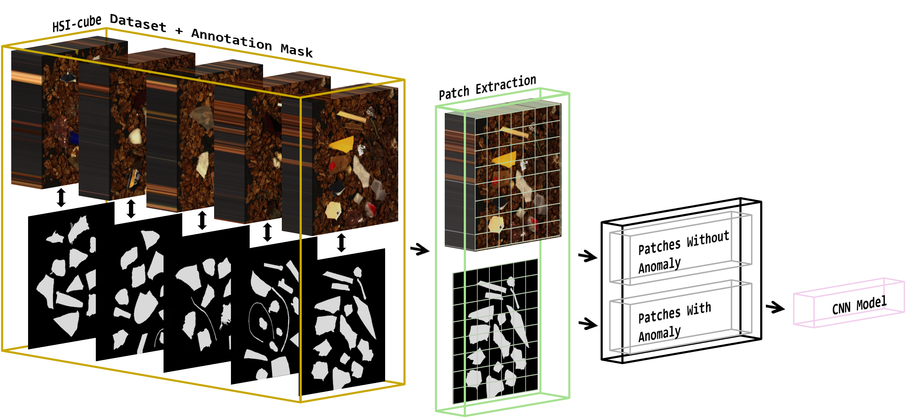
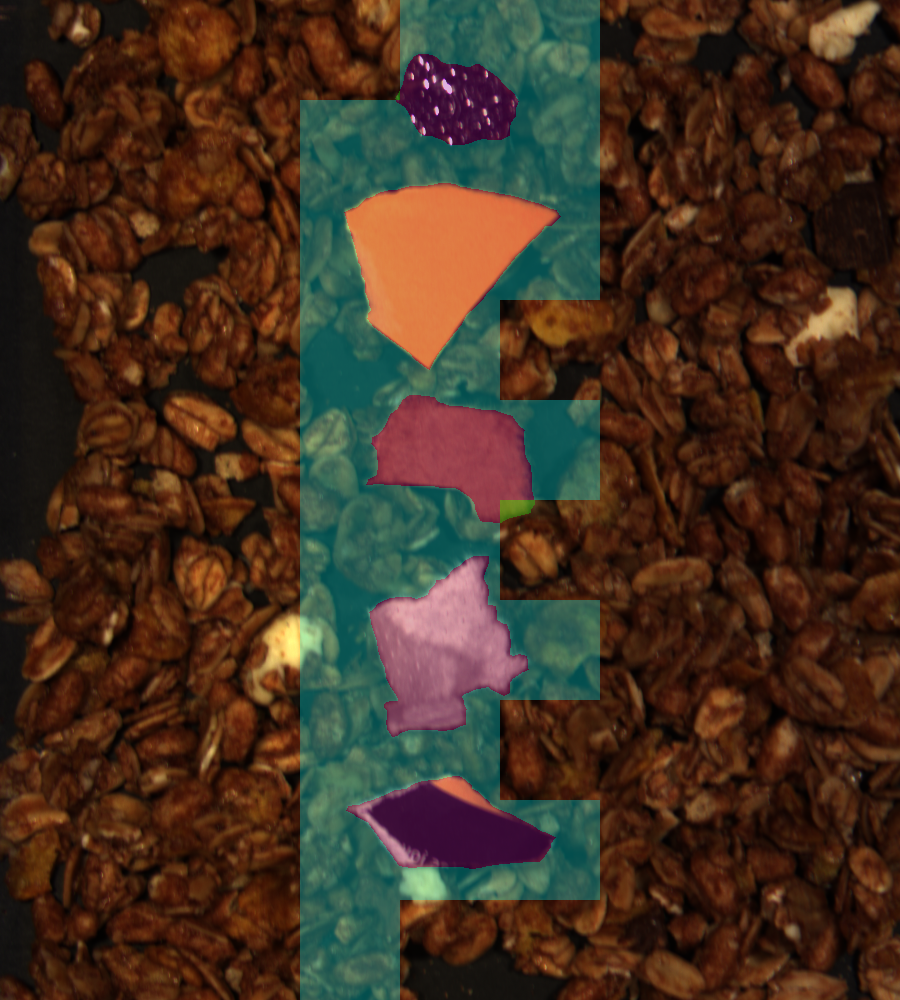
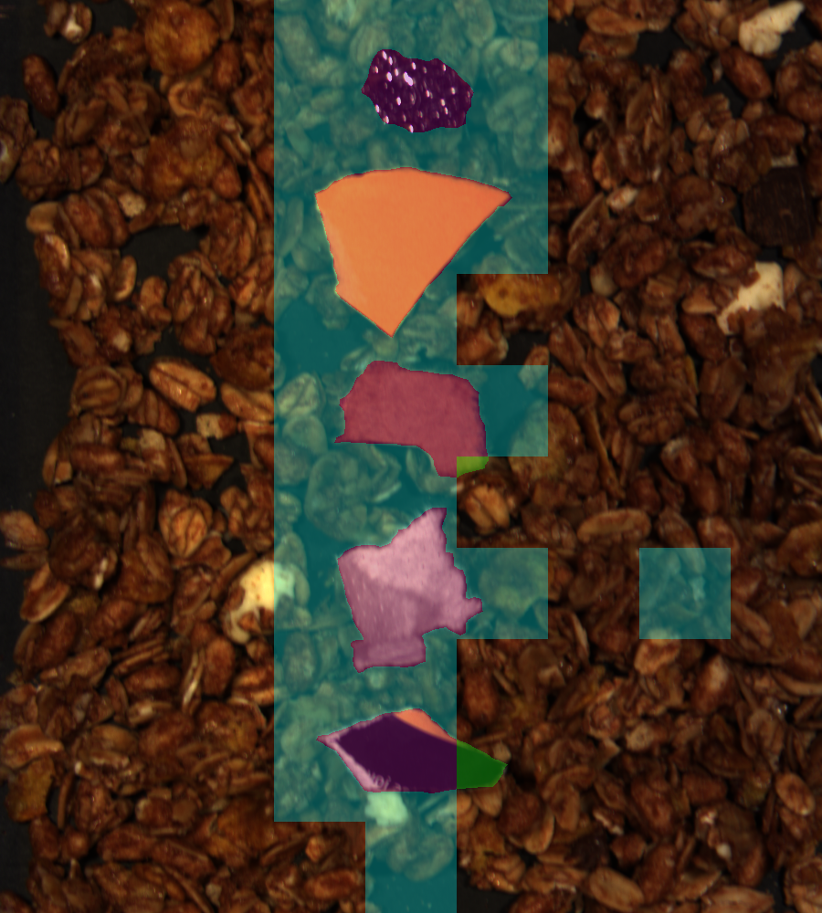
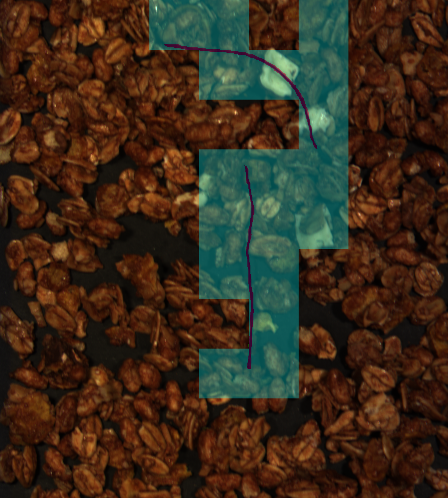
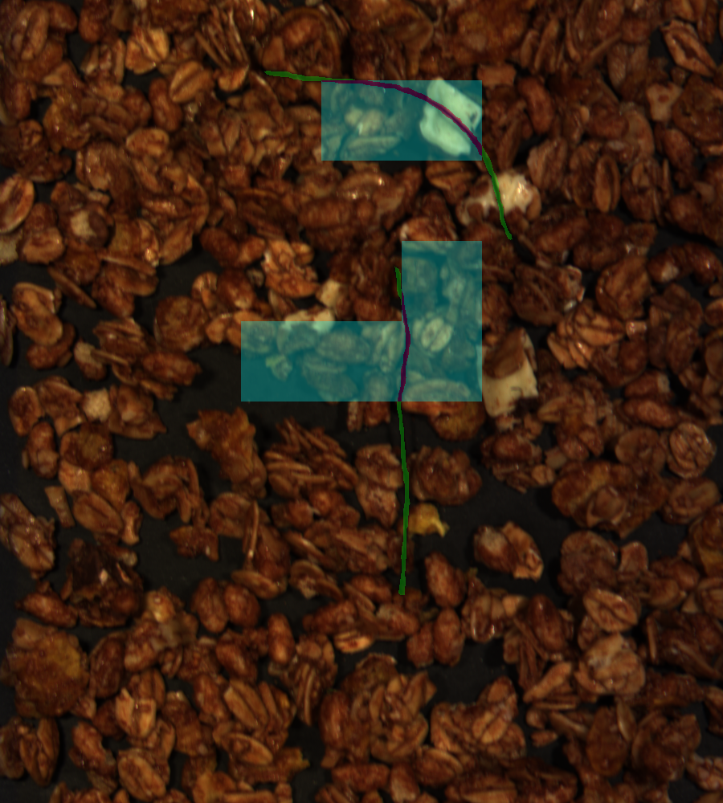
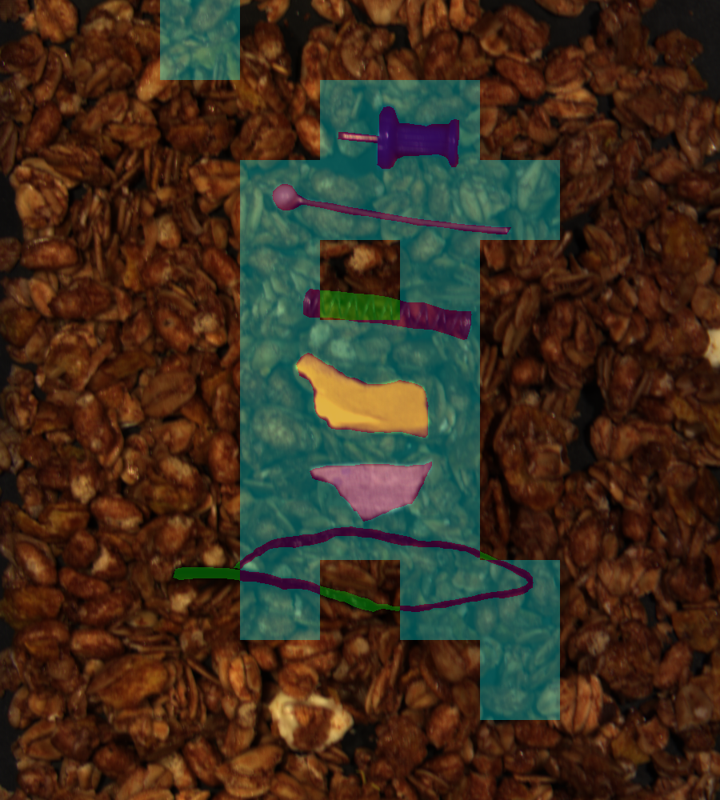
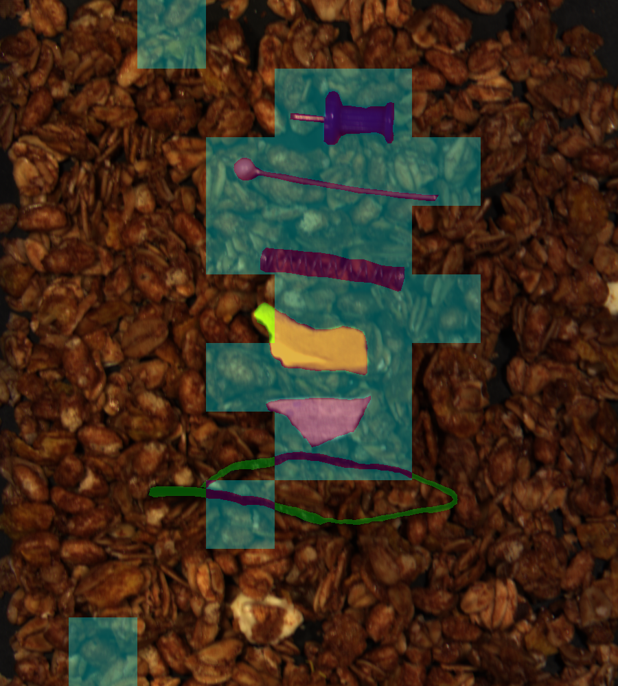

# HSI-AgriFoodAnomaly

<div align="center">
  
</div>
<p align="left"><em>Figure 1: Real-time acquisition setup: A pushbroom hyperspectral camera captures the conveyor line-by-line. After acquiring `n` lines, the resulting sub-cube is analyzed via CNN inference to detect potential anomaly.</em></p>

**HSI-AgriFoodAnomaly** is the first open-access hyperspectral dataset specifically designed for **anomaly detection in industrial agri-food production environments**. The dataset contains 147 annotated hyperspectral image cubes acquired under realistic conveyor-based conditions, with a wide variety of **visually ambiguous and challenging anomalies** (e.g., plastic, textile, metal, glass, paper, wood, mineral).

This repository includes:
- The full dataset with RGB projections and pixel-level annotations.
- A baseline deep learning pipeline for anomaly detection using 2D CNNs adapted to 300 HSI-band as input.
- Scripts for patch extraction, training, evaluation, and visualization.
---

## Dataset Overview

The dataset was constructed through a carefully controlled acquisition pipeline that simulates industrial food inspection. It captures a wide variety of **realistic and challenging anomalies** placed in **diverse, non-trivial scenes**. Each hyperspectral cube is annotated at the pixel level, allowing the training of models for multiple computer vision tasks.

**Use case:** Inline inspection of oat-based food products (e.g., oat flakes with chocolate chips), simulating real-world production conditions (occlusion, clutter, varying densities).

**1. Anomaly types:**  
- Plastics (rigid fragments and films)  
- Textiles (cotton, mesh, threads)  
- Metals (nails, foil, clips, sponges)  
- Paper (kraft, printed, glossy)  
- Wood/plant fragments  
- Minerals/glass (stones, shards)
- Mixed anomaly scenes
- Anomaly-free samples
- New anomalies

**2. Annotations:**  
- Pixel-level binary masks  


**3. Setup Description:**  

| Property             | Value                          |
|----------------------|--------------------------------|
| Number of scenes     | 147 HSI cubes                  |
| Spectral range       | 400–1000 nm (VNIR)             |
| Spectral bands       | 300                            |
| Spatial resolution   | 1000 × 900 pixels              |
| Acquisition setup    | Conveyor-based pushbroom system|
| Formats              | `.bil`, `.bil.hdr`, `.png`     |


**4. Dataset Split Summary:**  


| Category                              | Train | Val | Test | Total |
|---------------------------------------|:-----:|:---:|:----:|:-----:|
| Textile and fiber-based materials     |  40   |  8  |  16  |  64   |
| Plastics                              |  20   |  4  |   8  |  32   |
| Paper-based materials                 |   5   |  1  |   2  |   8   |
| Metals                                |   5   |  1  |   2  |   8   |
| Wood, plant-based, minerals, glass    |   5   |  1  |   2  |   8   |
| Mixed (multi-object scenes)           |   5   |  1  |   2  |   8   |
| Normal (anomaly-free)                 |   9   |  1  |   3  |  13   |
| For inference only                    |   –   |  –  |   5  |   5   |
| New anomaly objects                   |   –   |  –  |   1  |   1   |
| **Total**                             | **89**|**17**|**41**|**147**|


**5. Dataset Download:**

> **Coming Soon:** Dataset will be downloadable from [data.gouv.fr link]  
> A guide will be provided for downloading, verifying integrity, and organizing the files.

**6. Dataset Structure:**

> To Do
---
## Baseline Method

We provide a simple but effective **real-time anomaly detection pipeline** using standard 2D convolutional neural networks (CNNs) adapted to hyperspectral inputs.

- CNN models used: MobileNetV2, ResNet18/50, TinyNet, EfficientNet, MixNet
- Input patch sizes: 300x100×100, 300x200×200, 300x300×300
- Binary classification: with anomaly vs. without anomaly
- Performance reported using accuracy, F1-score, AUC, MCC
- Comparison with RGB-only models also included

<div align="center">
  
</div>
<p align="left"><em>Figure 2: Training pipeline: Hyperspectral cubes are labeled, patched, and classified based on the presence or absence of anomalies. These patches are used to train a CNN model for binary classification.</em></p>

## How to Run

> Python 3.8+ and a CUDA-enabled GPU are recommended.

#### 1. Clone the repository
```bash
git clone https://github.com/lsllabisen/HSI-AgriFoodAnomaly-Dataset.git
cd HSI-AgriFoodAnomaly-Dataset
```
#### 2. Install dependencies
```bash
pip install -r requirements.txt
```
#### 3. Required Configuration (configs/config.yaml)
```bash
project:
  base_path: /absolute/path/to/your/project           # Root path of the project
  project_name: YourExperimentName                    # Name of your experiment

data:
  train:
    cube_dir: /path/to/train/HSI-Hypercube            # HSI training data
    rgb_dir: /path/to/train/RGB/PNG                   # RGB training images
    mask_dir: /path/to/train/Annotation/PNG           # Annotation masks (training)
  val:
    cube_dir: /path/to/val/HSI-Hypercube
    rgb_dir: /path/to/val/RGB/PNG
    mask_dir: /path/to/val/Annotation/PNG
  test:
    cube_dir: /path/to/test/HSI-Hypercube
    rgb_dir: /path/to/test/RGB/PNG
    mask_dir: /path/to/test/Annotation/PNG

model:
  save_dir: /path/to/save/models                      # Where to save trained models

results:
  save_dir: /path/to/save/results                     # Where to save output results (.csv, etc.)

```
#### 4. Extract patches from annotated HSI cubes
```bash
nohup python3 run_data_patching.py
```
This will generate a new folder named after `project_name` inside `base_path`.
This folder will contain the preprocessed data ('patches') organized and ready to be used for training, validation, and testing of CNN models.


#### 5. Train a CNN model
```bash
nohup python3 run_train.py --config configs/config.yaml --RGB_HSI RGB --patch_size 300 --gpu 3
```
**Parameters explanation:**

- `--config` : path to your `config.yaml` file  
- `--RGB_HSI` : specify the data modality for the experiment (`HSI` or `RGB`)  
- `--patch_size` : patch size to use; options are `100`, `200`, or `300`  
- `--gpu` : ID of the GPU to use (this script supports **single GPU** execution only)

**Results**

- Trained models are saved in the directory specified by `model.save_dir` in your config file  
- CSV evaluation results and metrics are saved in the directory specified by `results.save_dir`
---

## Results and Analysis

This work demonstrates that HSI-trained CNNs outperform their RGB-based counterparts, especially for subtle or unseen anomalies.

**Key findings:**

- HSI consistently improves F1-score and MCC
- Best results with patch size 100×100 using TinyNet and ResNet18
- RGB models perform well but struggle on visually ambiguous anomalies

**Visual Comparison: RGB vs HSI (3 samples)**

<table>
  <tr align="center" style="font-weight:bold;">
    <td>HSI</td>
    <td>RGB</td>
    <td>HSI</td>
    <td>RGB</td>
    <td>HSI</td>
    <td>RGB</td>
  </tr>
  <tr>
    <td></td>
    <td></td>
    <td></td>
    <td></td>
    <td></td>
    <td></td>
  </tr>
  <tr align="center" style="font-weight:bold;">
    <td>Acc = 0.967<br> F1-score = 0.939<br> AUC = 0.944<br> MCC = 0.917</td>
    <td>Acc = 0.955<br> F1-score = 0.920<br> AUC = 0.997<br> MCC = 0.890</td>
    <td>Acc = 0.944<br> F1-score = 0.857<br> AUC = 0.960<br> MCC = 0.823</td>
    <td>Acc = 0.855<br> F1-score = 0.435<br> AUC = 0.892<br> MCC = 0.440</td>
    <td>Acc = 0.933<br> F1-score = 0.870<br> AUC = 0.949<br> MCC = 0.826</td>
    <td>Acc = 0.888<br> F1-score = 0.772<br> AUC = 0.927<br> MCC = 0.705</td>
  </tr>
</table>

<p align="left"><em>Figure 3: Comparison of RGB and HSI images using the best tinynet_a model with 100×100 patches. Colors indicate prediction overlays: cyan = Anomaly detection, green = ground truth, magenta = overlap (true positives). Performance metrics shown per example: Accuracy (Acc), F1-score (F1), AUC, and MCC.model predictions across 3 test samples.</em></p>

---

## Coming Soon

We plan to:

- Add more complex and fine-grained anomalies (e.g. small or partially occluded objects)
- Extend the dataset to new industrial use cases: meat products, nuts, coffee beans, ready-to-eat meals
- Enhance diversity and realism to support real-world agri-food inspection systems

---

## Contact & Licensing

This dataset and code are released for **non-commercial research and academic use only**.

If you intend to use this work for commercial or industrial purposes, please contact:

- **PhD. Mohammed El Amine BECHAR** — mohammed-el-amine.bechar@isen-ouest.yncrea.fr
---


## Citation

If you use this dataset or code, please cite our work:

```bibtex
@article{bechar2025hsiagrifoodanomaly,
  title={HSI-AgriFoodAnomaly: A Hyperspectral Dataset for Anomaly Detection in the Agro-Food Industrial Sector},
  author={Bechar, Mohammed El Amine},
  journal={Computers and Electronics in Agriculture},
  year={2025}
}
```
---
## Contributors

- **PhD. Mohammed El Amine BECHAR** — Researcher at [L@bISEN](https://isen-lille.fr/laboratoire-de-recherche-labisen/), ISEN Ouest
- **PhD. Nesma SETTOUTI** — Researcher at [L@bISEN](https://isen-lille.fr/laboratoire-de-recherche-labisen/), ISEN Ouest
- **PhD. Nadine ABDALLAH SAAB** — Researcher at [L@bISEN](https://isen-lille.fr/laboratoire-de-recherche-labisen/), ISEN Ouest 
- **PhD. Olga ASSAINOVA** — Researcher at [L@bISEN](https://isen-lille.fr/laboratoire-de-recherche-labisen/), ISEN Ouest
- **PhD. Marwa EL BOUZ** — Researcher at [L@bISEN](https://isen-lille.fr/laboratoire-de-recherche-labisen/), ISEN Ouest 


